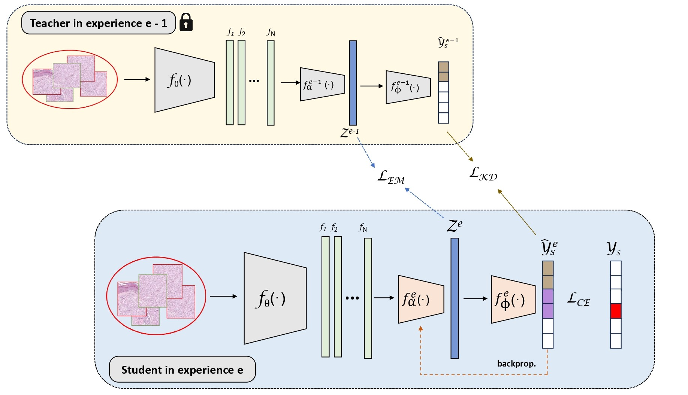

# MICIL: Multiple Instance Class-Incremental Learning

[MICIL: Multiple-Instance Class-Incremental Learning for skin cancer whole slide images](https://doi.org/10.1016/j.artmed.2024.102870)

[Pablo Meseguer<sup>1,2</sup>](https://scholar.google.es/citations?user=4r9lgdAAAAAJ&hl=es&oi=ao), [Rocío del Amor<sup>1</sup>](https://scholar.google.es/citations?user=CPCZPNkAAAAJ&hl=es&oi=ao), [Valery Naranjo<sup>1,2</sup>](https://scholar.google.com/citations?user=jk4XsG0AAAAJ&hl=es&oi=ao)

<sup>1</sup>[Universitat Politècnica de València (UPV)](https://www.upv.es/), <sup>2</sup>[valgrAI](https://valgrai.eu/es/)

## Setting up MICIL

* Clone MICIL repository. Intalle  a compatible torch version with your GPU and required libraries
```
git clone https://github.com/PabloMeseguerEsbri/MICIL.git
cd MICIL
pip install torch==1.12.0+cu116 torchvision==0.13.0+cu116 torchaudio==0.12.0 --extra-index-url https://download.pytorch.org/whl/cu116
pip install -r requirements.txt
mkdir local_data
mkdir local_data\models
mkdir local_data\figures
```

## Usage

* Data downloading for reproducibility

MICIL is validated in a multi-center dataset of WSI with a diganosis of cutaneos spindle cell (CSC) neoplasms encompassing six cancer subtypes. As MICIL uses a VGG16 pre-trained on ImageNet as feature extractor, we release the patch-level embeddings of the WSI to facilitate the reproducibility of the framework. 

From [this link](https://upvedues-my.sharepoint.com/:f:/g/personal/pabmees_upv_edu_es/EktGvxUsoEJFi0hltONyuTQBWWKzeSt4EoC5PrVyh2R4xA?e=0B3u2B), you can manually download the files from of the partitions and the embeddings and store them in separte subfolders within `./local_data/`. Each `.npy` file contain Nxd matrix where N denotes the number of patches of the slide and L the dimension of the instance-level features. 

* Joint training

In incremental learning, joint training refers to training the model by interleaving samples from all tasks. This method’s performance may be seen as an upper bound of what our proposed method can achieve. 

```
python main_joint_training.py --name_experiment AI4SKIN_JointTraining --lr 1e-5 --epochs 20 --gamma 0.9
python main_joint_testing.py --name_experiment AI4SKIN_JointTraining --test_set 2_4_0_5_3_1_test
```


* Incremental learning training

Our implementation allows the reproducibility of fine-tuning (FT), Learning without Forgetting (LwF) and MICIL (ours) under the multiple isntance learning (MIL) paradigm.
  
```
python main_MICIL.py --name_experiment AI4SKIN_MICIL --mode MICIL_train --scenario sceE2 --method MICIL --wn
python main_MICIL.py --name_experiment AI4SKIN_MICIL --mode MICIL_test --scenario sceE2
```
